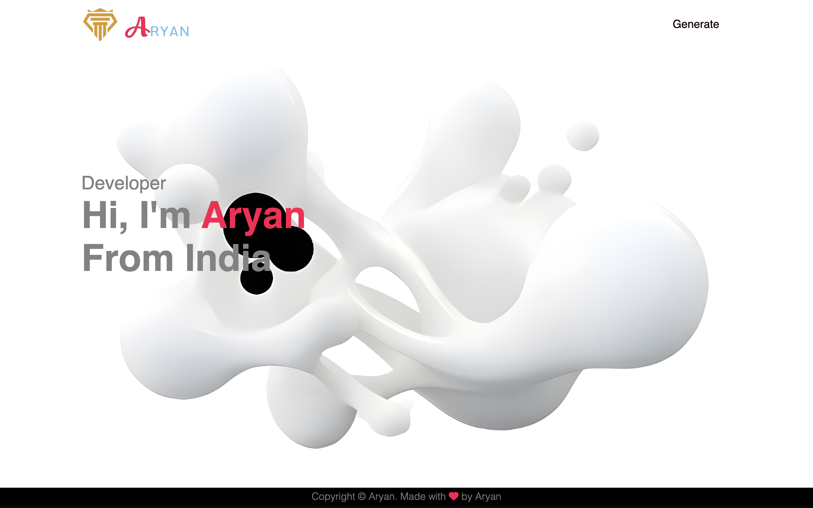
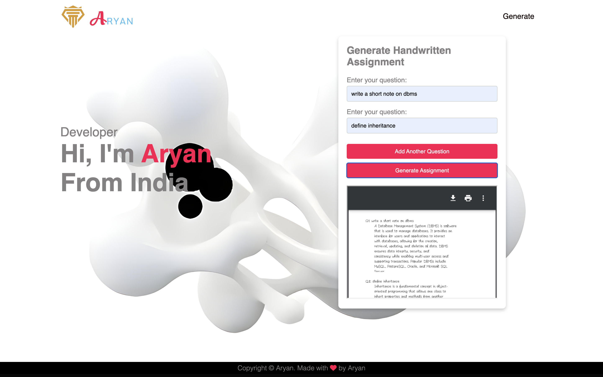
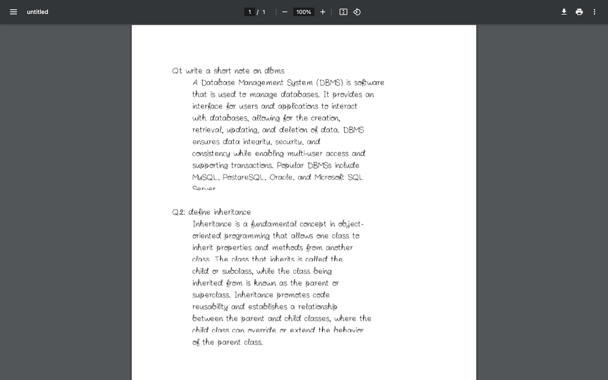
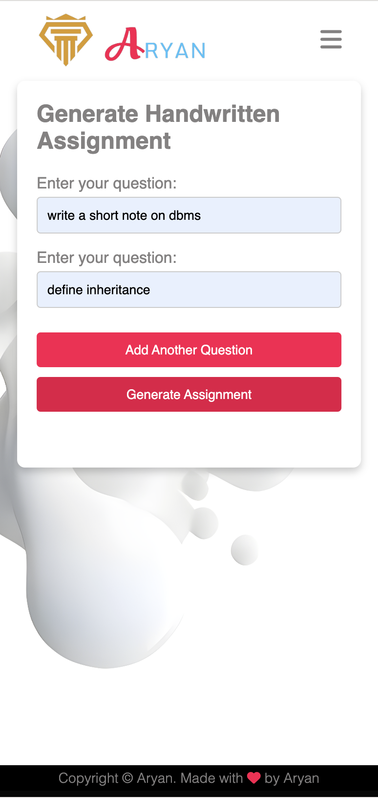

# Scriptify

**Scriptify** is a web application built with Flask that allows users to generate PDFs from handwritten text. The application is designed to be simple and intuitive, providing a smooth experience across both mobile and desktop devices.


## Features

- **Handwritten Font Integration:** Choose from a selection of elegant handwriting fonts.
- **Responsive Design:** Optimized for mobile and desktop viewing.
- **User-Friendly Interface:** Easily generate and download PDFs with a single click.
- **Dynamic Form Integration:** The form is integrated directly into the screen for a seamless user experience.

## Screenshots

**Homepage**



**Form Interface**



**PDF Output**



**Smartphone Output**



## Installation

To get started with Scriptify, clone the repository and set up your environment:

```bash
git clone https://github.com/yourusername/scriptify.git
cd scriptify
python -m venv venv
source venv/bin/activate  # On Windows use `venv\Scripts\activate`
pip install -r requirements.txt
```

## License

This project is licensed under the MIT License - see the LICENSE file for details.

## Acknowledgments

Flask: For the web framework.
ReportLab: For PDF generation.
Google Fonts: For providing handwriting fonts.
Any other tools or resources used in the development of Scriptify.
Contributing
Contributions are welcome! If you have any suggestions or improvements, please open an issue or submit a pull request. For significant changes, please discuss them with us via GitHub Issues before making a pull request.

## Contact
For any inquiries or further information, you can reach out via the following:

- **GitHub: ARYAN-ark-1
- **Thank you for using Scriptify!
